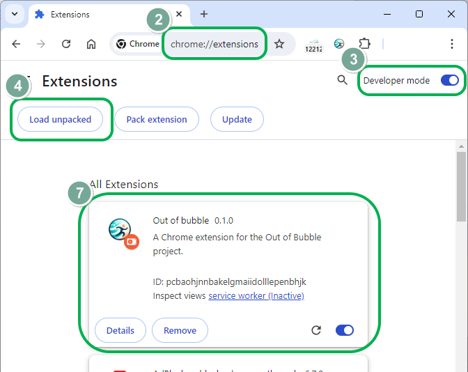
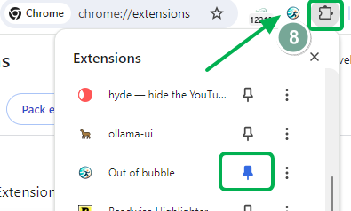
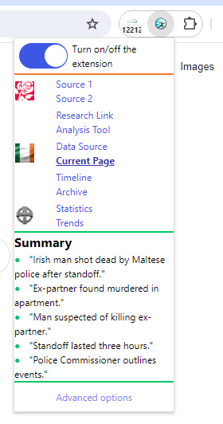
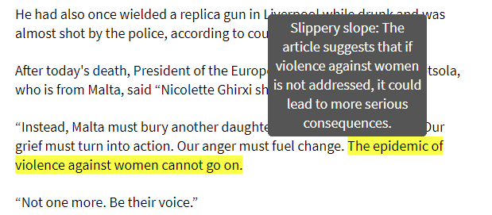

# Chrome Extension for the "Out of the bubble" project

This Chrome extension was made as a user-side interface of the "Out of the bubble" project.

> [!WARNING]
> The project name is temporary. It will be changed in the near future.


## Building the Extension Using Node.js

Go to the root directory of the project.

```shell
npm install
npm run build
```

During the building process, the `dist` directory will be created or overwritten. The compiled extension could be found there.

## Loading the Extension in Chrome

1. Open the Chrome browser.
2. Go to `chrome://extensions/`.
3. Enable the Developer mode.
4. Click on __Load unpacked__.
5. Select the `dist` directory containing the extension files.
6. Click __Select Folder__.
7. The extension will be loaded.
8. Pin the extension to the toolbar by clicking the pin button in the extension dropdown. This pin will make it easier to test the extension.
9. The popup page will appear when you click the  extension icon.








## What the Extension can do

### Highlight manipulative tactics in the article

